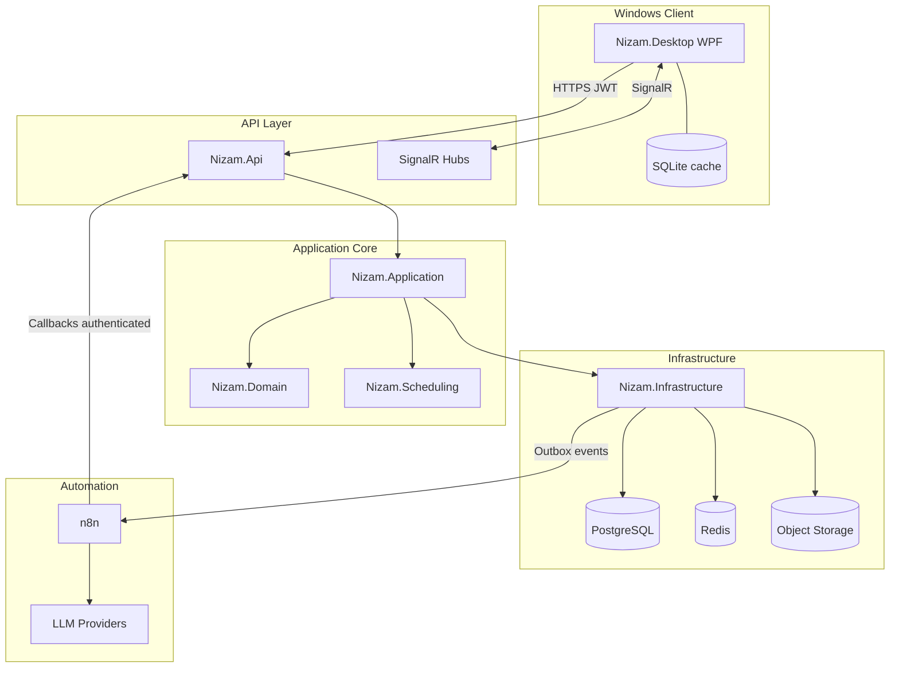

# NIZAM — Chief Architect Blueprint

**Product:** Nizam — Enterprise Project Controls  
**Primary client:** Windows desktop (WPF)    
**Code identifiers:** English (types, APIs, routes); display strings Turkish  
**Branch context:** `section-78` — architecture only; no implementation code in this document’s companion deliverable set.  
**Status:** Approved architectural baseline for MVP → Phase 5

---

## 1. Final System Architecture

Nizam is a **Windows-native enterprise project controls platform** with a thin, high-performance desktop client and a server-owned domain.

```
┌─────────────────────────────────────────────────────────────────┐
│                     Nizam.Desktop (WPF / .NET)                  │
│  Ribbon · Navigation · Activity Grid · Gantt · Offline SQLite   │
└───────────────────────────────┬─────────────────────────────────┘
                                │ HTTPS + SignalR + JWT
┌───────────────────────────────▼─────────────────────────────────┐
│                        Nizam.Api (ASP.NET Core)                 │
│  AuthZ · Validation · ProblemDetails · OpenAPI · SignalR hubs   │
└───────────────┬─────────────────────────────┬───────────────────┘
                │                             │
┌───────────────▼───────────────┐   ┌─────────▼───────────────────┐
│     Nizam.Application         │   │    Nizam.Scheduling         │
│  Commands/Queries · DTOs      │   │  CPM · Calendars · Float    │
│  Validators · Orchestration   │   │  Critical/Longest Path      │
└───────────────┬───────────────┘   │  Resource Leveling (Ph2)    │
                │                   └─────────┬───────────────────┘
┌───────────────▼─────────────────────────────▼───────────────────┐
│                         Nizam.Domain                            │
│  Aggregates · Invariants · Domain Events · Value Objects        │
└───────────────────────────────┬─────────────────────────────────┘
                                │
┌───────────────────────────────▼─────────────────────────────────┐
│                    Nizam.Infrastructure                         │
│  EF Core · Outbox · Redis · S3 · Entra · Serilog/OTel           │
└───────┬─────────────────┬─────────────────┬─────────────────────┘
        │                 │                 │
   PostgreSQL           Redis          S3-compatible
   (source of truth)   (cache/queue)   (documents)
        │
        │ Outbox → webhook / queue consumer
        ▼
      n8n  (orchestration only: notify, approve, report, AI workflows)
```

### Non-negotiable decisions

| Decision | Why |
|---|---|
| PostgreSQL is SoT | Auditable, relational integrity for WBS/activities/relationships/baselines; concurrent enterprise writes |
| Desktop never talks to PG in production | Security boundary; authz lives server-side; no permanent DB credentials on clients |
| Scheduling is a separate .NET library | Deterministic, testable CPM/calendar math must not live in controllers, ViewModels, or n8n |
| n8n is not SoT | Automation must be replaceable; business rules stay in Domain/Application |
| AI never owns schedule math | LLMs hallucinate; float/CPM must be deterministic code with evidence |
| Baselines immutable | Contractual controls require snapshot tables, not soft flags on live rows |
| WPF primary client | Dense grids, keyboard, offline, Gantt performance — web-first would undermine the product |

---

## 2. Visual Architecture Diagram



---

## 3. Responsibility Boundaries

| Layer / Component | Owns | Must NOT own |
|---|---|---|
| **Nizam.Desktop** | UX, editing, virtualization, local cache, presentation state | Business rules, schedule math, authz decisions |
| **Nizam.Api** | Transport, auth middleware, OpenAPI, SignalR fan-out | Domain invariants, CPM |
| **Nizam.Application** | Use-case orchestration, validation, transactions, DTO mapping | UI concerns, persistence details |
| **Nizam.Domain** | Aggregates, invariants, domain events, pure domain services | EF, HTTP, n8n, LLM |
| **Nizam.Scheduling** | Graph, calendars, forward/backward pass, float, critical/longest path, leveling | Persistence, notifications |
| **Nizam.Infrastructure** | EF, Redis, S3, Entra adapters, outbox publisher | Product policy |
| **n8n** | Notifications, approvals routing, scheduled briefs, integrations, AI orchestration | CPM, budgets, RBAC, DB |
| **AI** | Explain, summarize, recommend, draft scenarios | Approve baselines, mutate production schedule, invent facts |
| **PostgreSQL** | Authoritative state + audit | Transient UI preferences (optional Redis/local) |

---

## 4. Complete Visual Studio Solution Structure

```
Nizam.sln
├── src/
│   ├── Nizam.Desktop                 # WPF shell, MVVM, Gantt, grids
│   ├── Nizam.Api                     # ASP.NET Core host, controllers/minimal APIs, hubs
│   ├── Nizam.Application             # Commands, queries, validators, handlers
│   ├── Nizam.Domain                  # Entities, VOs, enums, events, exceptions
│   ├── Nizam.Infrastructure          # EF Core, Redis, S3, auth, outbox, logging
│   ├── Nizam.Scheduling              # Pure scheduling library (referenced by Application)
│   ├── Nizam.Automation.Contracts    # Event DTOs / webhook payloads for n8n
│   └── Nizam.Shared                  # Cross-cutting primitives (Result, Error codes, time helpers)
├── tests/
│   ├── Nizam.Domain.Tests
│   ├── Nizam.Application.Tests
│   ├── Nizam.Scheduling.Tests        # Highest priority early
│   ├── Nizam.Infrastructure.Tests
│   ├── Nizam.Api.IntegrationTests
│   └── Nizam.Desktop.Tests
└── deploy/
    ├── docker-compose.yml
    └── .env.example
```

### Project responsibilities (summary)

- **Desktop:** Fluent-inspired shell; Activity grid; Gantt; API client; optional SQLite sync.
- **Api:** Edge of the system; maps HTTP ↔ application; never embeds schedule algorithms.
- **Application:** Vertical-slice use cases (`CreateProject`, `RunSchedule`, `CreateBaseline`).
- **Domain:** Organization isolation, WBS tree invariants, activity/relationship rules, baseline immutability.
- **Infrastructure:** DbContext, migrations, repositories/query adapters, Redis, object storage, Entra token validation, outbox dispatcher.
- **Scheduling:** Deterministic, side-effect-free where possible; input models in → `ScheduleResult` out.
- **Automation.Contracts:** Versioned event schemas (`PROJECT_CREATED`, `SCHEDULE_CALCULATED`, …).
- **Shared:** No domain leakage; only truly shared types.

**Later (not MVP):** `Nizam.Worker`, `Nizam.Reporting`, `Nizam.AI`, `Nizam.Sync`.

---

## 5. Core Domain Model

### Aggregate roots (MVP-critical)

```
Organization
  └── Portfolio → Program → Project
                              ├── WbsNode (tree)
                              ├── Activity
                              ├── ActivityRelationship
                              ├── Calendar (+ patterns/intervals/exceptions)
                              ├── Baseline (immutable snapshot aggregate)
                              ├── ScheduleRun / ScheduleVersion
                              └── ProgressUpdate
```

### Key aggregates & invariants

| Aggregate | Invariants |
|---|---|
| **Organization** | Tenant boundary; all child entities carry `OrganizationId` |
| **Project** | Status machine (Draft→…→Archived); DataDate; default calendar; root WBS required |
| **WbsNode** | Acyclic parent chain; unique `WbsCode` per project; no delete with blocking children unless cascade policy explicit |
| **Activity** | Belongs to one WBS; milestones duration = 0; calendar resolved (activity→project→org) |
| **ActivityRelationship** | No self-link; unique pair+type policy; graph must remain DAG after add |
| **Calendar** | Working intervals non-overlapping within day; exceptions override patterns |
| **Baseline** | Immutable after approval; stored as snapshot tables |
| **ScheduleRun** | Idempotent trigger key optional; status Queued/Running/Completed/Failed |

### Value objects / enums (illustrative)

- `ProjectCode`, `ActivityCode`, `WbsCode`
- `WorkingDuration` (minutes of working time — never wall-clock days alone)
- `RelationshipType` (FS/SS/FF/SF), `ConstraintType`, `ActivityType`, `ActivityStatus`, `ProjectStatus`
- Money as `Money(amount, currency)` for later cost phases

---

## 6. PostgreSQL Entity Map (MVP → Phase 4 core)

### Identity & tenancy
`Organizations`, `Users`, `OrganizationMembers`, `Roles`, `Permissions`, `RolePermissions`, `ProjectMembers` (project-scoped access)

### Hierarchy
`Portfolios`, `Programs`, `Projects`

### Planning
`WbsNodes`, `Activities`, `ActivityRelationships`, `Calendars`, `CalendarWorkPatterns`, `CalendarWorkIntervals`, `CalendarExceptions`

### Controls
`Baselines`, `BaselineProjects`, `BaselineWbsNodes`, `BaselineActivities`, `BaselineRelationships`, `ProgressUpdates`, `ScheduleRuns`, `ScheduleVersions` (+ optional `ScheduleActivityResults` for large runs)

### Phase 2+
`Resources`, `ResourceRoles`, `ResourceRates`, `ResourceAssignments`

### Phase 3+
`ProjectBudgets`, `BudgetVersions`, `CostItems`, `Expenses`, `ActualCostEntries`

### Phase 4+
`Risks`, `RiskActions`, `Issues`, `ChangeRequests`, `ChangeApprovals`, `Documents`, `DocumentVersions`

### Platform
`AuditLogs`, `DomainEvents` / `OutboxMessages`, `Notifications`, `NotificationPreferences`, `AiConversations` (Phase 5)

### Critical indexes (examples)

| Index | Purpose |
|---|---|
| `(OrganizationId, ProjectId)` on Activities | Tenant+project scoping |
| `(ProjectId, WbsId)` | Activity-by-WBS |
| `(ProjectId, PredecessorActivityId)`, `(ProjectId, SuccessorActivityId)` | Relationship graph load |
| `(ProjectId, IsCritical)` | Critical path filters |
| `(OrganizationId, ResourceId, Start, Finish)` later | Capacity windows |
| Unique `(ProjectId, ActivityCode)`, `(ProjectId, WbsCode)` | Code integrity |
| Outbox `(ProcessedAt, CreatedAt)` | Dispatcher polling |

Concurrency: `xmin`/EF `RowVersion` (`bytea` concurrency token) on Activities, Projects, Relationships.

---

## 7. Entity Relationship Explanation

- **Organization** is the **hard tenant wall**. Every query in Application/Infrastructure must filter by it.
- **Portfolio/Program** are optional grouping layers above **Project** (portfolio controls without forcing every org to use them).
- **WBS** is a **closure-friendly tree** (`ParentWbsId`). Rollups are computed (or materialized later) — not free-typed folders.
- **Activities** hang off WBS leaves/nodes; **Relationships** form a **DAG** across activities in a project.
- **Calendars** are referenced by project/activity/resource; scheduling engine consumes calendar snapshots for a run.
- **ProgressUpdates** are **append-only history**; activity actuals are projections updated by application rules.
- **Baselines** copy structural schedule/cost slices into baseline tables — live rows continue to change.
- **ScheduleRuns** record computation metadata; optional detail rows enable compare-runs without recompute.
- **OutboxMessages** couple domain commits to external automation **in the same DB transaction**.

---

## 8. Scheduling Engine Architecture

`Nizam.Scheduling` is a **pure computational library**. Application loads aggregates → builds `ScheduleInput` → calls `ISchedulingEngine.Calculate` → persists `ScheduleResult`.

```
Nizam.Scheduling/
  Graph/          ScheduleGraph, ActivityNode, DependencyEdge, CycleDetector, TopologicalSorter
  Calendars/      WorkingCalendar, CalendarCalculator
  CPM/            ForwardPass, BackwardPass, Float, CriticalPath, LongestPath
  Constraints/    ConstraintProcessor
  Resources/      DemandCalculator, LevelingEngine   (Phase 2)
  Models/         ScheduleInput, ScheduleResult, ActivityScheduleResult
  Services/       SchedulingEngine
```

### Algorithm pipeline

1. Load activities, relationships, calendars, constraints, DataDate  
2. Build DAG  
3. Detect cycles → fail with structured error  
4. Topological sort  
5. Apply actuals / remaining logic relative to **DataDate**  
6. Forward pass → Early Start/Finish (working-time arithmetic)  
7. Backward pass → Late Start/Finish  
8. Total Float / Free Float  
9. Critical set (configurable float threshold) + Longest Path  
10. Project finish + diagnostics  
11. Persist ScheduleRun + emit `SCHEDULE_CALCULATED`

### Calendar engine (non-negotiable)

Do **not** use `DateTime.AddDays` for durations. All shifts use:

`AddWorkingMinutes`, `SubtractWorkingMinutes`, `GetNextWorkingTime`, `GetPreviousWorkingTime`, `CalculateWorkingDuration`, `IsWorkingTime`

Support patterns, intervals, holidays, exceptions, shutdowns.

### Relationship semantics

FS/SS/FF/SF with lag (positive) and lead (negative), evaluated in **working minutes**.

### Why separate from Application

- Massive unit-test surface without DB  
- Can later host as Worker process for 50k+ activities without rewriting math  
- Prevents accidental UI/API coupling to algorithm internals  

---

## 9. WPF Desktop Architecture

```
Nizam.Desktop/
  App.xaml (+ DI host)
  Views/          Main shell, Project workspace, Activity, Gantt, Dashboard…
  ViewModels/     Thin: bindable state, commands → services
  Services/       ApiClient, Auth, Navigation, Dialog, Notification, LocalCache
  Controls/       NizamDataGrid, GanttControl, TimelineHeader, DependencyLayer, WbsTree
  Converters/, Behaviors/, Resources/Themes
```

### Patterns

- **MVVM + CommunityToolkit.Mvvm** (`[ObservableProperty]`, `[RelayCommand]`)
- **DI** at composition root; no service locator
- ViewModels call **application API services**, not Domain
- Long operations: `async` + `CancellationToken`; never block UI thread
- Saved layouts/filters as user preferences (API or local)

### Shell

Top command bar · Left navigation · Main workspace · Bottom status (DataDate, last schedule run, sync state)

---

## 10. Gantt Architecture

Split pane:

| Left | Right |
|---|---|
| Virtualized activity/WBS grid | Virtualized timeline canvas |

### Sync

Shared scroll/viewport model: row index ↔ time window. One selection model across grid and bars.

### Rendering strategy

- **Do not** instantiate one heavy `UserControl` per bar at 50k scale.
- Prefer a custom `FrameworkElement`/`DrawingVisual`/`Skia`/WriteableBitmap strategy with:
  - Row virtualization (only visible rows)
  - Time culling (only visible window)
  - LOD by zoom (day/week/month/quarter/year)
- Layers: baseline bars, current bars, progress, milestones, dependency polylines (critical styled), DataDate & Today lines, constraints

### Interaction

Drag move / resize → command to API (or local draft then save); snap to working time; dependency creation tool later.

---

## 11. API Architecture

Style: **REST + OpenAPI**, SignalR for fan-out. Controllers/minimal APIs remain thin.

```
Controller / Endpoint
  → ISender / handler (Application)
    → Domain invariants
    → Nizam.Scheduling (when needed)
    → Infrastructure persistence
  → Domain event → Outbox
  → SignalR broadcast (same process or bus)
```

### MVP endpoint groups

`/api/organizations`, `/api/projects`, `/projects/{id}/wbs|activities|relationships|calendars`,  
`/projects/{id}/schedule/run|status`, `/projects/{id}/baselines`, `/projects/{id}/progress`, `/api/auth`

Cross-cutting: JWT bearer, permission policies (`schedule.run`, `baseline.approve`, …), ProblemDetails, correlation IDs, idempotency keys on progress/import/webhooks.

---

## 12. n8n Workflow Map (orchestration only)

| ID | Trigger | Purpose |
|---|---|---|
| P01–P03 | Project lifecycle | Welcome, status, archive hygiene |
| A01–A04 | Activity/progress | Create notify, delay, complete, progress submitted |
| S01–S05 | Schedule | Completed, delay alert, CP changed, negative float, quality report |
| R01–R03 | Resources (Ph2) | Overallocation, shortage, leveling done |
| F01–F05 | Cost (Ph3) | Thresholds, CPI, overrun |
| B01–B03 | Baseline | Approval routing, created, major variance |
| RK01–RK03 | Risk (Ph4) | High risk, reminders, escalation |
| C01–C04 | Change (Ph4) | New/approve/reject flows |
| RP01–RP04 | Reporting | Daily/weekly/monthly/portfolio |
| AI01–AI05 | AI (Ph5) | Assistant orchestration, delay/risk/recovery/exec summary |
| SYS01–SYS05 | System | Notification engine, errors, DLQ, health, audit fan-out |

**Rule:** n8n receives **versioned contracts** from Outbox; it never calculates CPM or writes budgets authoritatively.

---

## 13. Event Architecture

### Domain events (examples)

`PROJECT_CREATED`, `ACTIVITY_UPDATED`, `RELATIONSHIP_CHANGED`, `SCHEDULE_CALCULATED`, `SCHEDULE_DELAYED`, `CRITICAL_PATH_CHANGED`, `BASELINE_CREATED`, `PROGRESS_UPDATED`, …

### Outbox pattern

1. Business transaction writes aggregate + `OutboxMessages` row  
2. Dispatcher publishes to n8n webhook / queue  
3. Mark processed; retries with backoff  
4. Later swap transport (RabbitMQ/Kafka/NATS/Redis Streams) without changing Domain  

SignalR is **orthogonal**: used for interactive UI sync, not for durable integration.

---

## 14. Redis Usage

Use Redis **selectively**, not as a second database:

| Use | Example |
|---|---|
| Short-lived cache | Project schedule summary, permission snapshot |
| Distributed locks | Schedule run mutex per `ProjectId` |
| Queue backing | Optional for workers / n8n queue mode |
| Rate limiting | API protection |
| Pub/sub (optional) | Multi-node SignalR backplane later |

Do **not** cache authoritative activity rows as source of truth.

---

## 15. Authentication Architecture

| Environment | Mechanism |
|---|---|
| Enterprise | Microsoft Entra ID (OIDC) → API validates access tokens |
| Desktop | MSAL public client → acquire token → Bearer to API |
| Development | Optional local identity / test users |
| Automation callbacks | Signed webhook secrets / service credentials — never anonymous |

Authorization: **RBAC + permission claims/policies**, org isolation on every query, project-level membership where needed. All sensitive actions → **AuditLog**.

---

## 16. MVP Definition

Ship the **scheduling core**, not the full suite.

**In MVP:** Auth, Org, Users/basic roles, Project, WBS, Activities, Relationships, Calendars, Scheduling Engine (CPM + critical path), Activity table, Gantt, Progress, Data Date, Baseline + comparison, Project dashboard (basic), Audit log, basic n8n notifications.

**Out of MVP:** Resource leveling, full EVM, Monte Carlo, XER import, offline sync completeness, Network diagram, full AI, portfolio intelligence.

### MVP user journey

Login → Create Org → Create Project → WBS → Activities → Relationships → Calendar → Run Schedule → Gantt/Critical → Baseline → Data Date → Progress → Recalculate → Baseline variance / delay.

---

## 17. Development Phases

| Phase | Focus |
|---|---|
| **MVP** | Org/Project/WBS/Activity/Rel/Calendar/CPM/Gantt/Progress/Baseline/Audit/n8n basics |
| **2** | Resources, capacity, histograms, leveling |
| **3** | Budgets, costs, expenses, EVM, cost dashboards |
| **4** | Risk, issues, change control, documents, advanced reports, portfolio |
| **5** | AI assistant, delay/risk/recovery, what-if scenarios, schedule health, forecasting |

Each phase ships as **vertical slices** (DB→Domain→App→API→Desktop→Tests).

---

## 18. Main Risks

| Risk | Mitigation |
|---|---|
| Schedule correctness | Exhaustive Scheduling.Tests; property tests for calendars |
| Calendar edge cases | Explicit exception model; golden-file fixtures |
| Gantt at 50k rows | Virtualization + canvas rendering from day one of Gantt |
| Baseline storage growth | Snapshot design; retention policy; compress cold baselines later |
| Multi-user edits | Optimistic concurrency + conflict UI |
| Permission complexity | Central permission catalog; integration tests |
| n8n reliability | Outbox, retries, SYS03 DLQ, never SoT |
| AI hallucination | Structured retrieval + deterministic calc first; cite evidence |
| Long schedule runs | Async job status; Redis lock; progress UI |
| Over-scoping MVP | Protect Phase boundaries ruthlessly |

**Correctness before optimization.**

---

## 19. Testing Strategy

| Layer | Focus |
|---|---|
| **Domain** | Project/WBS/Activity rules, baseline immutability, relationship validation |
| **Scheduling** | FS/SS/FF/SF, lag/lead, calendars/holidays, constraints, milestones, cycles, forward/backward, float, critical/longest path |
| **Application** | Command handlers with fakes; authorization paths |
| **API integration** | AuthN/Z, CRUD, schedule run, baseline, progress |
| **Desktop** | ViewModel state, validation, command enablement (light UI tests) |

Scheduling tests are the **product’s trust anchor**.

---

## 20. First Vertical Slice

Connect the full stack for the core value loop:

1. Create Organization  
2. Login  
3. Create Project (root WBS + default calendar side effects)  
4. Create WBS nodes  
5. Create Activities  
6. Create Relationships  
7. Assign/confirm Calendar  
8. Run Scheduling Engine  
9. Persist Early/Late/Float/Critical  
10. Activity Table + Gantt  
11. Then: Baseline → Data Date → Progress → Recalc → Variance  

This slice proves Nizam is a **scheduler**, not a task board.

---

## 21. Exact Creation Order (files/projects)

1. `Nizam.sln` + Directory.Build.props (nullable, analyzers)  
2. `Nizam.Domain` (entities/enums/events for Org/Project/WBS/Activity/Relationship/Calendar)  
3. `Nizam.Scheduling` (graph + calendar calculator stubs → CPM)  
4. `Nizam.Scheduling.Tests` (red tests first for FS chain)  
5. `Nizam.Application` (CreateProject, CreateActivity, RunSchedule commands)  
6. `Nizam.Infrastructure` (DbContext, configurations, migrations, Outbox)  
7. `Nizam.Api` (auth stub, endpoints, Swagger)  
8. `Nizam.Automation.Contracts` (event payloads)  
9. `Nizam.Shared`  
10. `docker-compose` (Postgres, Redis, MinIO, n8n)  
11. `Nizam.Api.IntegrationTests`  
12. `Nizam.Desktop` (shell → project list → activity grid → Gantt skeleton)  
13. Wire SignalR + basic n8n `SYS01` notification for `SCHEDULE_CALCULATED`  
14. Baseline + Progress slices  

---

## 22. Initial NuGet Packages

### Cross-cutting / Backend
- `Microsoft.AspNetCore.OpenApi` / Swashbuckle
- `Microsoft.EntityFrameworkCore` + `Npgsql.EntityFrameworkCore.PostgreSQL`
- `Microsoft.AspNetCore.Authentication.JwtBearer`
- `Microsoft.Identity.Web` (Entra)
- `StackExchange.Redis`
- `AWSSDK.S3` (S3-compatible including MinIO)
- `Serilog.AspNetCore` + sinks
- `OpenTelemetry.*` (tracing/metrics)
- `FluentValidation` (+ DI integration)
- `MediatR` (or equivalent dispatcher)
- `CommunityToolkit.Mvvm` (**Desktop**)

### Desktop
- `Microsoft.Extensions.Hosting` / DI packages for WPF host
- `Microsoft.AspNetCore.SignalR.Client`
- `Microsoft.Identity.Client` (MSAL)
- `Microsoft.Data.Sqlite` / EF SQLite (offline later)
- High-perf grid: evaluate `CommunityToolkit` + custom grid **or** commercial DataGrid later — decide at Activity Table slice (prefer custom/virtualized path for Gantt sync)

### Test
- `xunit`, `FluentAssertions`, `NSubstitute`/`Moq`, `Microsoft.AspNetCore.Mvc.Testing`, `Testcontainers.PostgreSql` (integration)

---

## 23. Local Development Environment

**Prerequisites:** .NET 8/9 SDK, Docker Desktop, Visual Studio 2022 or Cursor + `dotnet` CLI, optional Azure Entra app registration for real OIDC (dev bypass otherwise).

**Run:**

1. `docker compose up -d` (Postgres, Redis, MinIO, n8n)  
2. Apply EF migrations / seed permissions & roles  
3. `dotnet run --project src/Nizam.Api`  
4. Launch `Nizam.Desktop` against `https://localhost:7xxx`  
5. Import n8n workflow stubs from `/deploy/n8n` when available  

Provide `.env.example` with connection strings, JWT/Entra settings, MinIO keys, n8n webhook secret.

---

## 24. Docker Compose Services

| Service | Role |
|---|---|
| `postgres` | Source of truth |
| `redis` | Cache / locks / queue aid |
| `minio` | S3-compatible documents |
| `n8n` | Automation (internal network; not public) |
| (optional later) | `mailhog`, `seq`/`jaeger` for local observability |

API and Desktop run on host for fast iteration; Worker comes later.

---

## 25. Next Step (exact)

**Implement nothing beyond scaffolding until this architecture is accepted.**

Immediate next implementation step after approval:

> **Slice 0 — Solution Scaffolding + Domain Skeleton + Docker Compose**  
> Create `Nizam.sln`, empty/skeleton projects listed in §4, Directory.Build.props, `docker-compose.yml` + `.env.example`, and **Domain entities only** for Organization, Project, WbsNode, Activity, ActivityRelationship, Calendar (+ child calendar tables), plus permission seed constants.  
> **Still no WPF screens, no CPM implementation body beyond interfaces, no n8n workflows yet.**

After Slice 0:

> **Slice 1 — Scheduling Engine FS happy-path** (tests first): two activities, FS, standard 8h calendar → assert Early/Late/Float/Critical.  

Then Application/API Create Project → Create Activity → Run Schedule, then Desktop read-only Activity Table.

---

## Appendix A — Product Identity Reminder

Nizam is **not** Primavera visually and **not** a generic task tool. Depth of P6-class controls + modern Microsoft-style dense desktop UX + automation + AI assistance — with deterministic scheduling as the heart of the system.
