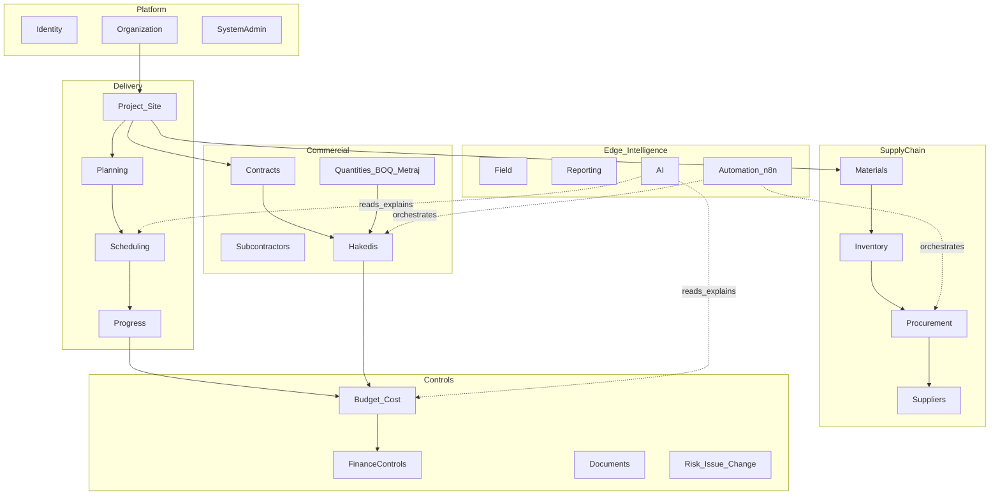
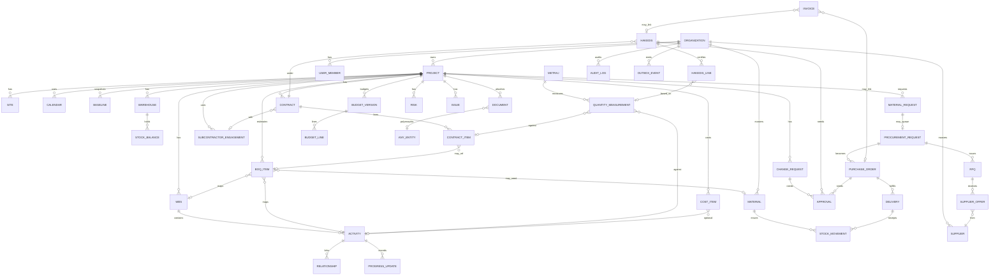

# NIZAM — Master Architecture Blueprint

**Rol:** Chief Architect & Chief Product Officer  
**Kaynak:** Master product prompt (`Documents/secondPrompt.txt`) §76–§78  
**Durum:** Mimari baseline (üretim kodu yok — blueprint)  
**UI varsayılanı:** Türkçe (`tr-TR`) + localization resources (hardcode yok)  
**İstemci:** Windows Desktop (WPF) birincil; Field PWA ikincil

Bu belge, mevcut `docs/ARCHITECTURE.md` (project-controls çekirdeği) ile çelişmez; onu **Construction ERP + commercial + field + intelligence** ölçeğine genişletir.

---

## 1. Product module map

| # | Modül (TR) | Product area | Phase |
|---|---|---|---|
| 1 | Proje ve Şantiye Yönetimi | Nizam Desktop / Controls | 1 |
| 2 | Planlama ve İş Programı | Nizam Schedule | 1 |
| 3 | Malzeme Yönetimi | Nizam Materials | 2 |
| 4 | Depo ve Stok | Nizam Materials | 2 |
| 5 | Satın Alma ve Tedarik | Nizam Procurement | 2 |
| 6 | Tedarikçi Yönetimi | Nizam Procurement | 2 |
| 7 | Taşeron Yönetimi | Nizam Commercial | 3 |
| 8 | Sözleşme Yönetimi | Nizam Commercial | 3 |
| 9 | Keşif Yönetimi | Nizam Commercial | 3 |
| 10 | Metraj Yönetimi | Nizam Commercial | 3 |
| 11 | Hakediş Yönetimi | Nizam Commercial | 3 |
| 12 | Bütçe Yönetimi | Nizam Cost | 3 |
| 13 | Maliyet Yönetimi | Nizam Cost | 3 |
| 14 | Finans Yönetimi | Nizam Cost / Finance | 4 |
| 15 | Doküman ve Evrak | Nizam Desktop | 4 |
| 16 | Risk Yönetimi | Nizam Controls | 4 |
| 17 | Sorun / Issue | Nizam Field / Controls | 4 |
| 18 | Değişiklik Yönetimi | Nizam Controls | 4 |
| 19 | Dashboard ve Raporlama | Nizam Desktop | 1 (basic) → 4 |
| 20 | İş Zekâsı | Nizam Cloud | 5 |
| 21 | Mobil Saha (PWA) | Nizam Field | 4 |
| 22 | Sistem Yönetimi | Platform | 1 |
| 23 | Entegrasyon Yönetimi | Nizam Automate / API | 2+ |
| 24 | AI Project Intelligence | Nizam AI | 5 |
| 25 | Workflow Automation | Nizam Automate (n8n) | 1 (basic) → 5 |

**Product family (architectural areas, not always separate brands):** Desktop, Schedule, Controls, Materials, Procurement, Commercial, Cost, Field, AI, Automate, Cloud.

---

## 2. Domain boundaries



**Boundary rule:** Cross-context communication via **domain events + application orchestration**, not shared mutable tables casually. Read models / projections allowed for dashboards.

---

## 3. Bounded contexts (explicit decisions)

| Context | Separate? | Decision | Rationale |
|---|---|---|---|
| Identity | Yes | Own context | AuthN, users, credentials; Entra/local |
| Organization | Yes (thin) | Tenancy, members, roles catalog | Hard isolation wall |
| Portfolio / Program | With Organization or Project | **Nested under Organization**, not separate deployable | Light grouping until portfolio intelligence |
| Project / Site | Yes | Project aggregate + sites | Central spine |
| Planning (WBS/Activities structure) | With Scheduling | **Same deployable**, clear modules | Same team, shared project FK |
| Scheduling (CPM) | Library + Application | **`Nizam.Scheduling` pure lib**; Application owns persist | Deterministic calc isolation |
| Progress | With Planning | Progress updates belong to project-controls | Same DB schema cluster |
| Resources (labor/equip) | Later separate module | Phase 2 of *controls*, after MVP schedule | Avoid early coupling |
| Materials | Yes | Material master | Different ubiquitous language |
| Inventory | Yes (paired with Materials) | Warehouse, stock, movements | Strong consistency with materials |
| Procurement | Yes | PR → RFQ → PO → Delivery | Approval-heavy |
| Suppliers | With Procurement | Supplier master | Shared with RFQ/PO |
| Contracts / Subcontractors | Yes | Commercial context | Legal/commercial language |
| Quantities (Keşif/BOQ/Metraj) | Yes | Measurement language | Links to WBS/activity/BOQ |
| Progress Payments (Hakediş) | Yes | Payment certificates | Depends on metraj + contract |
| Cost Control / Budget | Yes | Budget, cost codes, forecast | EVM later |
| Finance | Yes (integration-friendly) | Cash flow, invoices; **statutory accounting may stay external SoT** | Master prompt §57 |
| Documents | Yes | Metadata in PG; bytes in S3 | Cross-cutting attach |
| Risk / Issue / Change | Yes (Controls) | Can share schema cluster | Phase 4 |
| Field Operations | Yes | PWA + daily reports | Offline-tolerant edge |
| Reporting | Yes (read models) | Prefer projections | Don’t overload OLTP |
| Automation | External (n8n) | Contracts only in-repo | Not SoT |
| AI | Yes (later) | Retrieval + LLM; no authoritative calc | Phase 5 |

**DbContext strategy (not one god context forever):**

- **MVP:** single `NizamDbContext` with **schema/module folders** and clear aggregates (pragmatic).
- **From Phase 2+:** split into bounded DbContexts or schemas (`planning`, `inventory`, `procurement`, `commercial`, `cost`) sharing `OrganizationId` / `ProjectId`, with integration via events/outbox.
- Never one massive domain service; one application handler per use case.

---

## 4. Conceptual ER model (aggregate connections)



### Aggregate boundaries (write consistency)

| Aggregate root | Inside boundary | Outside (ref by id) |
|---|---|---|
| Organization | Members, role bindings, settings | Projects |
| Project | Sites, default calendar link, status, data date | Activities via Planning module |
| WbsNode | Tree invariants | Activities |
| Activity | Duration/dates/float fields (updated by schedule run) | Relationships as separate aggregate or project graph service |
| Relationship graph | Validated as project-scoped graph | — |
| Baseline | Immutable snapshot children | Live activities |
| Material | Master data | Stock |
| Warehouse | Location | Stock balances |
| StockMovement | Immutable ledger entry | Balances derived/updated transactionally |
| MaterialRequest | Lines, status | ProcurementRequest |
| ProcurementRequest / RFQ / PO | Commercial supply chain docs | Suppliers |
| Contract | Items, parties | Hakediş |
| QuantityMeasurement | Measured qty | Hakediş lines |
| Hakediş (PaymentCertificate) | Lines, approval state | Finance posting |
| BudgetVersion | Lines | Cost actuals |
| Document | Version metadata | S3 object |
| ChangeRequest | Impact fields, approvals | Schedule/budget updates only after approve |

---

## 5. Windows architecture

- **Nizam.Desktop** (WPF, MVVM, CommunityToolkit.Mvvm, DI)
- Shell: command bar + nav + workspace + status (Turkish labels via **resources**, not hardcoded)
- Progressive disclosure: basic roles see Proje / İlerleme / Bütçe / Malzeme / Ödemeler / Sorunlar; planners unlock float/constraints/etc.
- Icon + Turkish text; large targets; calm premium Fluent-inspired density
- Offline/SQLite later for field-adjacent desktop cache; **no direct PG**
- Gantt: virtualized custom control; Activity grid professional density
- Localization: `.resx` / satellite assemblies from day one; default `tr-TR`

---

## 6. Backend architecture

```
Nizam.Api → Nizam.Application → Nizam.Domain
                ↘ Nizam.Scheduling (pure)
Nizam.Infrastructure → PostgreSQL, Redis, S3, Outbox, Entra/JWT
```

- Clean/modular monolith first; extract workers later (`Nizam.Worker`)
- MediatR commands/queries; FluentValidation; ProblemDetails (TR messages)
- SignalR for collaborative schedule/progress updates
- OpenAPI; idempotency on webhooks/progress/imports

---

## 7. Scheduling architecture

- **`Nizam.Scheduling`**: calendars, DAG, CPM, float, critical/longest path, constraints, (later) leveling
- Application loads project graph → `ScheduleInput` → persist `ScheduleResult`
- Data Date separates actuals vs remaining
- Baselines immutable snapshots
- AI/n8n **never** authoritative for CPM

---

## 8. Construction ERP architecture (Materials spine)

**Purpose:** Connect site need → stock → buy → receive → consume, and surface schedule risk when procurement slips.

Flow:

```
MaterialRequest → Stock check
  → Reserve OR ProcurementRequest
    → RFQ → SupplierOffer → Award → PurchaseOrder
      → Delivery → WarehouseReceipt (StockMovement)
        → Issue to activity/WBS
```

Events drive n8n approvals/notifications; **stock quantities live in PostgreSQL**.

---

## 9. Procurement architecture

Aggregates: ProcurementRequest, RFQ, SupplierOffer, PurchaseOrder, Delivery.  
Approvals threshold-configurable.  
Link optional `ActivityId` / `WbsId` for schedule risk (“steel PO delayed → activity on CP”).

---

## 10. Warehouse architecture

Warehouse per project (or shared org warehouse assigned to projects).  
StockBalance (Material × Warehouse) + append-only StockMovement (Receipt, Issue, Transfer, Adjustment, Reserve).  
Reservations soft-allocate until issue.

---

## 11. Subcontractor architecture

Subcontractor party master + Project engagement.  
Links to Contracts, site attendance (later), progress submissions, safety docs.  
Not just a “vendor clone” — commercial + field performance.

---

## 12. Contract architecture

Contract types: Client, Subcontractor, Supplier (as needed).  
ContractItem lines (qty, unit, rate, WBS/BOQ refs).  
Amendments via ChangeRequest when schedule/cost impacted.  
Status machine: Draft → Approved → Active → Closed.

---

## 13. BOQ / Metraj architecture

- **Keşif / BOQ:** estimate structure (items, units, rates) mapped to WBS/activities/materials  
- **Metraj:** measured quantities over time (gross/net, location, period)  
- Measurements feed Hakediş and optional progress %

---

## 14. Hakediş architecture

Payment certificate periods under a Contract.  
Lines from approved metraj / contract items.  
Retention, deductions, previous cumulative, this period, VAT as configured.  
Approval workflow (n8n orchestrates; PG holds state).  
Post-approval may emit finance events (invoice/cash forecast) — not silent schedule edits.

---

## 15. Budget / Cost architecture

- Budget versions (Original, Approved, Current)  
- Cost codes hierarchy  
- Actuals from PO receipts, timesheets (later), expenses, hakediş  
- Forecast / EAC; EVM (PV/EV/AC) in cost phase  
- Tie optional to Activity/WBS for SPI/CPI rollup

---

## 16. Document architecture

- PG: Document + DocumentVersion (entity type/id polymorphic)  
- S3/MinIO: bytes  
- Approval workflows for drawings, method statements, hakediş packs  
- Virus scan / content-type allowlists later

---

## 17. Nizam Field architecture

- PWA (not replacing Desktop for planners)  
- Daily site report, photos, progress entry, issues, material requests  
- Offline queue → sync API with conflict rules  
- Same auth org isolation; reduced surface permissions

---

## 18. n8n architecture

- Role: orchestration only (approvals, reminders, notifications, AI workflow glue, report fan-out)  
- Input: versioned events from Outbox (`Nizam.Automation.Contracts`)  
- SYS01 Notification Engine centralizes channels (email, Teams, in-app, …)  
- Never SoT; never CPM; never bypass RBAC  
- Queue mode + workers in production

---

## 19. AI architecture

- Assistants retrieve **structured** project data + deterministic calc results  
- May explain delays, draft recovery scenarios, summarize executives  
- Must label: Actual / Calculated / Recommendation  
- Must not auto-approve hakediş, mutate baseline, change contract dates, apply recovery without human confirm

---

## 20. Reporting architecture

- Operational reports from API/read models (Excel/PDF/CSV)  
- Executive dashboards: project + finance + portfolio health  
- Later BI warehouse / semantic layer optional — not required for MVP  
- Turkish titles/formats by default

---

## 21. Localization architecture

| Concern | Approach |
|---|---|
| Default culture | `tr-TR` |
| UI strings | Resx / resource dictionaries; **no hardcode in Views/VMs** |
| API errors | Resource keys → TR messages |
| Dates | `dd.MM.yyyy` default |
| Numbers/money | TR grouping/decimal; multi-currency fields |
| Casing/search | Turkish i/İ/I/ı aware collation/normalization |
| Future locales | EN, DE, CS, AR, RU — same resource pipeline |

---

## 22. Authentication / authorization

- Entra ID (enterprise) + JWT API; MSAL desktop; local/dev auth  
- RBAC + permission catalog; project-level membership where needed  
- Organization isolation on every query  
- Field and Desktop least privilege

---

## 23. Audit architecture

- Immutable AuditLog (who/what/when/old/new/correlation)  
- Required on money, schedule approve, baseline, hakediş approve, stock adjust, permission changes

---

## 24. Event architecture

- Domain events + **Outbox** in same DB transaction as state  
- Transport today: webhook/n8n; later Rabbit/Kafka/NATS without domain rewrite  
- SignalR separate (interactive sync, not durable integration)

Representative events: `PROJECT_CREATED`, `SCHEDULE_CALCULATED`, `MATERIAL_REQUEST_CREATED`, `STOCK_LOW`, `PURCHASE_ORDER_APPROVED`, `DELIVERY_DELAYED`, `QUANTITY_APPROVED`, `PAYMENT_CERTIFICATE_APPROVED`, `COST_THRESHOLD_EXCEEDED`, `CHANGE_REQUEST_CREATED`, …

---

## 25. Integration architecture

- Inbound/outbound via API + Automate  
- Accounting system may remain statutory SoT; Nizam posts journals/events  
- Idempotent webhooks; signed secrets; no public n8n editor

---

## 26. Deployment architecture

| Env | Stack |
|---|---|
| Dev | Docker Compose: Postgres, Redis, MinIO, n8n; API+Desktop on host |
| Prod API | Containers / Linux or Windows Server; cloud-ready |
| Desktop | MSIX + auto-update |
| Field | Hosted PWA HTTPS |
| Secrets | Not in client; KeyVault/env |

---

## 27. MVP (Phase 1) — what we ship first

Per master prompt §70 — **validate Nizam**, do not build full ERP:

Organization · Users/roles · Projects · WBS · Activities · Calendars · Dependencies · Scheduling Engine · CPM · Critical Path · Data Date · Baseline · Progress · Gantt · Project Dashboard · Audit · Basic n8n

**MVP success journey:** Login → Org → Project → WBS → Activities → Relationships → Calendar → Run schedule → Gantt/Critical → Baseline → Data Date → Progress → Recalc → Variance visible.

**Explicitly out of MVP:** Materials/warehouse/procurement commercial stack, hakediş, full finance, field PWA, AI, Monte Carlo, XER.

**Gap vs current codebase (honest):** Schedule/API core largely exists; remaining MVP hardening = real WPF head + localization resources (remove hardcoded TR strings) + Postgres-backed local runbook + richer Gantt rendering on Windows.

---

## 28. Development roadmap

| Phase | Focus | Outcome |
|---|---|---|
| **0 — Blueprint** | This document | Shared mental model |
| **1 — Project Controls MVP** | §70 list | Credible scheduler |
| **2 — Construction ERP** | Materials, warehouse, stock, MR, PR, RFQ, suppliers, PO, deliveries | Supply chain closed loop |
| **3 — Commercial** | Taşeron, contracts, keşif, metraj, hakediş, budget/cost/forecast | Money + measure |
| **4 — Management & Field** | Finance controls, documents, risk/issue/change, Field PWA, richer reports | Site + controls |
| **5 — Intelligence** | AI assistant, delay/recovery, what-if, BI, advanced automation | Decision support |

Vertical slice rule each phase: Domain → Application → API → Desktop/Field → Tests → Events/n8n stubs.

---

## 29. Major risks

| Risk | Mitigation |
|---|---|
| Scope explosion into full ERP before CPM trust | Ruthless Phase 1 gate |
| Schedule incorrectness | Scheduling.Tests as trust anchor |
| Calendar / working-time bugs | Golden fixtures |
| Gantt performance at 50k activities | Virtualization from first Windows Gantt |
| One giant DbContext/services | Module folders now; split contexts from Phase 2 |
| n8n as accidental SoT | Outbox contracts + code reviews |
| AI hallucination on money/schedule | Deterministic calc first; cite evidence |
| Hardcoded TR UI blocking i18n | Resources from day one |
| Hakediş/legal complexity | Dedicated commercial context; approval audit |
| Multi-tenant leakage | Org checks on every handler |
| Integration dual-write | Outbox + idempotency |

**Correctness before optimization; simplicity for users before feature count.**

---

## 30. Recommended next step (after this blueprint is accepted)

1. Gap review: map current repo → Phase 1 checklist  
2. Localization foundation (shared resource project)  
3. Windows WPF head wired to existing ViewModels/API  
4. Only then Phase 2 ERP design slices  

**Do not start Materials/Hakediş implementation until Phase 1 MVP is accepted as “credible scheduler” on Windows.**
